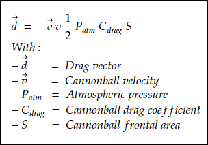

# Cannon Warfare

### General Information

This project was made for the ISART Digital school by Rémi Serra, Florestan Mazurié and Julien Bertrand. <br>
The goal was to create a realistic simulation of a 2D cannon. The cannonballs had to be subject to drag and should show their trajectories. A cannonball's trajectory also had to be predicted, with the air time, the maximum height and the landing distance.

<br>

## Preview


<br>

## Features

- Real-time simulated cannonballs with:
    - a position
    - a velocity
    - an acceleration
    - display of trajectory
    - a precise timer to get the exact air time
    - bouncing simulation applied upon hitting the ground (see ```CannonBall.cpp > ApplyBouncingLogic()```)
    - drag applied at each frame to acceleration using the following formula: <br>
         <br>
        See [this link](https://www.physagreg.fr/mecanique-12-chute-frottements.php) for more info. <br>
        See ```CannonBall.cpp > ComputeDrag()```.

<br>

- Cannonball trajectory prediction with near-perfect accuracy (see ```Cannon.cpp > UpdateTrajectory()```)
    - Without drag, this is done instantly by solving the cannonball's movement equation to get its landing position and velocity, then the trajectory is drawn as a bezier curve.
    - With drag, the cannonball's movement equation becomes very hard to solve without iteration. Our solutions were either to use euler's method, or to simulate a cannonball and save its position at regular intervals. We went for the second one since both use iteration and euler's method would grant similar results in similar time frames so it felt like overkill.

<br>

- The cannonball's muzzle velocity is computed using the following formula: <br>
     <br>
    See [this link]("https://www.arc.id.au/CannonBallistics.html") for more info. <br>
    See ```Cannon.cpp > ComputeMuzzleVelocity()```.

<br>

- Cannon recoil is applied using the following formula: <br>
     <br>
    See [this link](https://www.omnicalculator.com/physics/recoil-energy) for more info. <br>
    See ```Cannon.cpp > ApplyRecoil()```.

<br>

- Cannonball collisions are applied using the following formula: <br>
     <br>
    See ```CannonBall.cpp > CheckCollisions()```.

<br>

- Tweakable variables:
    - Powder charge
    - Barrel length
    - Projectile radius
    - Projectile mass
    - Cannon height
    - Cannon rotation

<br>

- Toggleable parameters:
    - Apply recoil
    - Apply drag
    - Apply collisions
    - Show predicted trajectory
    - Show predicted measurements
    - Show cannonball trajectories
